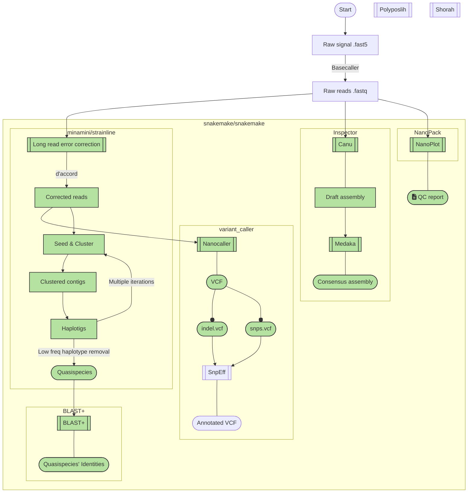

# HIV-64148 Pipeline
THIS PIPELINE IS UNDER DEVELOPMENT, NO FEATURES ARE GUARANTEE TO WORK AT THIS MOMENT.
# Purpose

- Dependency management and installation of tools is a time consuming process.
- Allows scienctist to focus on science rather than software.
- This container contains software used in HIV quasispecies analysis pipeline
- The pipeline can be used for long-read only or hybrid analysis
- The pipeline produces quansispecie sequences, consensus sequence, and variant calling files

This is a software package incoperated with pipeline for an analysis of viral genome. It can performs reference based consensus assembly, variant calling and reference-free quasispecies assembly and identification on long-read data particularily from Oxford Nanopore technology. This software package aims to consolidate analytical tools needed for the analysis into a single, easy to use, portable Docker container which can be rapidly deployed on any machine regardless of its environment.

Wrapped around a software package is an analysis pipeline uses viral haplotypes assembler pipeline, Strainline, from [HaploKit](https://github.com/HaploKit) to produce quansispecie sequences witout the need of reference genome, this pipeline produces corrected read using local de bruijn graph construction method, this corrected read is also used by NanoCaller to call out the variation, the output VCF files (indel, snps) are then annotated using variant annotator and effect prediction tool, SnpEff. This same corrected reads then go into mulitple iteration of seed and cluster producing haplotigs which are then finalized into full-lenght haplotypes, these haplotypes are identified against a database of 32 HIV strains of selected laboratory clones, subtypes, and CRFs. The consensus sequence is produced by NanoHIV pipeline from [ramics](https://github.com/ramics) which uses multiple iterations of alignment and polishing with Nanopolish to produce a final consensus sequence.

# Installation

There is no installation for this pipeline - it can be invoked directly on the command line using Snakemake (see [instruction](https://snakemake.readthedocs.io/en/stable/getting_started/installation.html)).

To invoke the pipeline `cd` into the workflow directory (where Snakefile is located) and simply call `snakemake -c${threads} --use-conda --use-singularity all`.

# The pipeline

We only require user to specified input and tweak some configuration, both dependencies and installation of the analysis softwares are managed by Snakemake conda environment and Singularity images provided with the pipeline.

## Configuration

The pipeline configuration file is in a yaml format and is located in a config directory, users can customize parameters as needed for each run.

### Input

You can place your input into `./input` directory. On this current version, custom file name is not supported, please name your input as …..

### Output

Your output will be present on `./output` directory after the pipline finished. Important output will be structured in directories as follow.

- output
    - alignment
        - reads_alignment.bam
        - reads_alignment.bam.bai
    - NanoHIV
        - consensus.fasta
    - strainline
        - haplotypes.final.fa
    - varient_calls
        - variant_snps.vcf
        - variant_indels.vcf
    - haplotype.blast.txt

### BLAST database

The database was created using selected laboratory clones, subtypes, and CRFs of 32 HIV strains listed in the supplementary ___ . This database is used to identified quasispecies produced by Strainline via BLASTN software.

## Tools

- Snakemake v7.18.2
- Strainline
    - d'accord v0.0.10
    - spoa v4.0.9
    - jgi_summarize_bam_contig_depths from metabat2
- Minimap2 v2.24
- Samtools v.1.10
- Nanocaller v3.0.0
- BLASTN v2.13.0+

### To be implemented

- Polypolish
- Medaka
- ShoRah
- SnpEff

## Process

# Known issue

- NanoHIV requires .fast5 files which aren’t avilable on GCP compute instance, waiting for upload.
- Nanocaller has issue with paralell processing
- Nanocaller calls low-quality snps
- Nanocaller produces empty indel file

# To optimize

- BLAST+ produces a report with cross-alignment data of all quasispecies vs database which makes the report cluttered and difficult to interprete.
- Interactive command-line based software to control custom input/output and configuration (currently I/O require user to change their name into specified name)

# Acknowledgement
This project is supported by The Health System Research Institute, Thailand (Grant HSRI-64-148)
